### О курсе

Цель курса: получить теоретические и практические навыки достаточные для того, чтобы спроектировать и реализовать высоконагруженную систему.

Каждое занятие состоит из 2 частей:

- Лекция
- Семинар

Для успешного прохождения курса надо будет успешно выполнить все домашние задания. Под успешным выполнением понимается:

- Написан код
- Код имеет тесты
- Тестами покрыты все сценарии описанные в условии
- Тесты проходят без ошибок
- Задание проверено преподавателем и поставлена оценка

Порядок выполнения домашнего задания:

- Пишется код и тесты
- Отлаженный код с тестами выкладывается на GitHub в свой репозиторий
- Репозиторий должен называться highload_2021
- Внутри репозитория должны быть директории 01, 02, ... - по номеру домашнего задания
- После того, как код оказался в репозитории на почтовый ящик, указанный в блоге дисциплины, надо написать письмо с просьбой проверить работу, в письмо включить ссылку к коду на GitHub
- Получить оценку или комментарии для исправления

Система оценки:

- Работа должна быть выполнена - это +1 балл
- Если работа выполнена (получена оценка) до начала следующего занятия - это еще +1 балл
- Еще +0-2 балла может поставить преподаватель на свое усмотрение
- итого, максимальный балл - 4

### Введение

#### Характеристики приложения

##### Удобство эксплуатации

- Хороший мониторинг
- Эффективные способы управления приложением

##### Масштабируемость

- Архитектура должна учитывать возможность роста нагрузки

##### Надежность

- Система продолжает работать ожидаемо даже при неблагоприятных обстоятельствах, например, при ошибочных действиях пользователя или аппаратных сбоях
- Предотвращает несанкционированный доступ и неправильную эксплуатацию
- Производительность достаточна при предполагаемой нагрузке и объеме данных

### Производительность

Увеличиваем пропускную способность - жертвуем временем обслуживания, и наоборот:

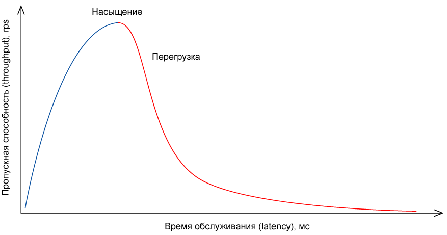

> requests per second (rps) - запросов в секунду

В системах пакетной обработки, например, Hadoop важна пропускная способность:

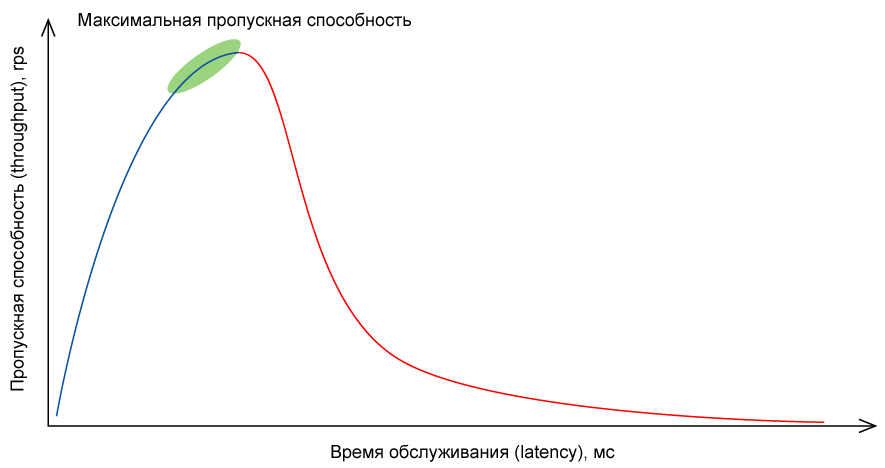

В онлайн системах часто важнее время обслуживания:

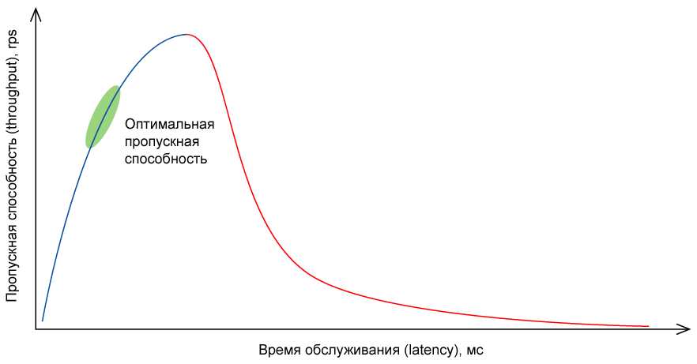

#### SLA (Service Level Agreement)

Обязанности перед клиентом: пропускная способность, время обслуживания, количество ошибок и т.д.

Пример SLA:

- Сервис доступен не менее 99,9% времени
- Медианное время обслуживания не более 100 мс

#### Оценка производительности

Использовать среднее значение для оценки не лучшая идея:

- Скрывают выбросы
- Выбросы смещают средние значения

Гораздо лучше использовать процентили:

- Отражают самый худший случай обслуживания
- Устойчивы к выбросам

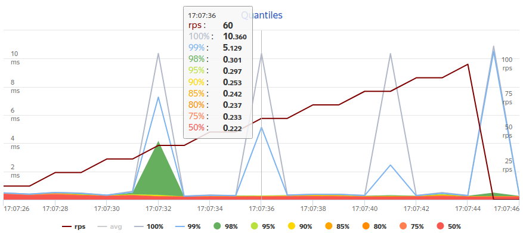

#### Практический пример

Для тестирования использовалась система Яндекс Танк:

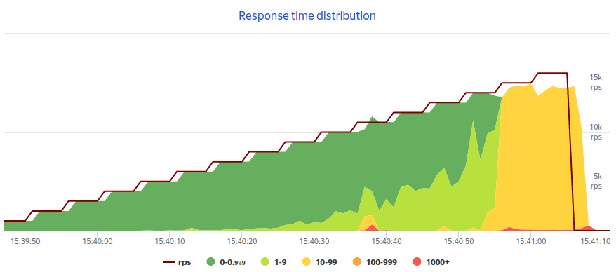

#### 5000 RPS

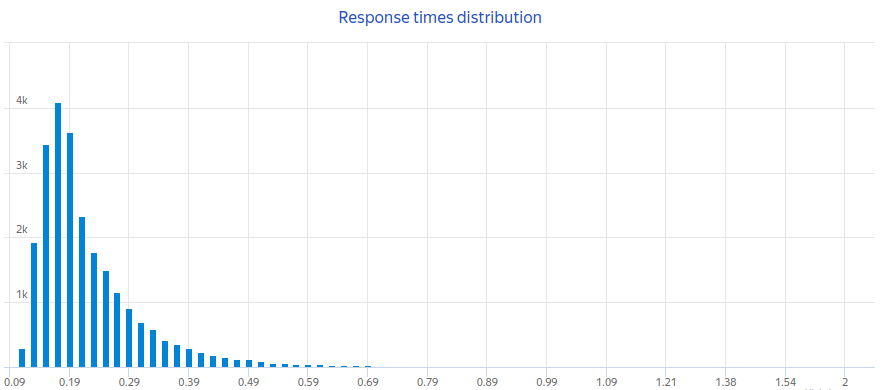
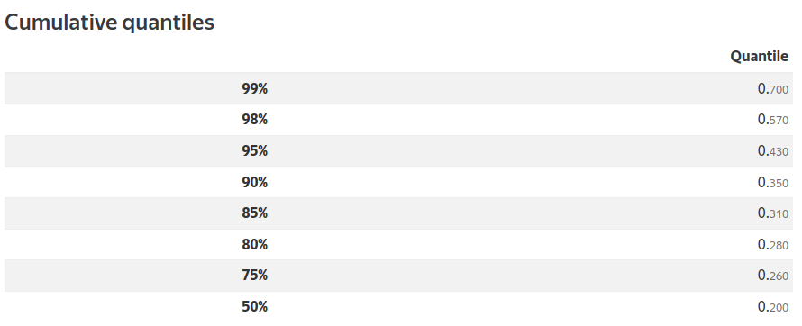

#### 10000 RPS

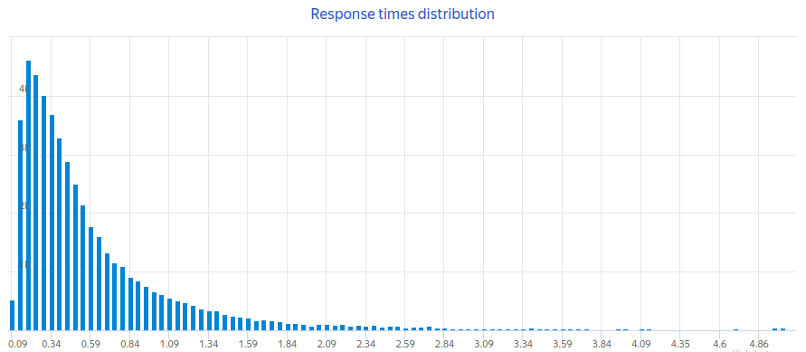
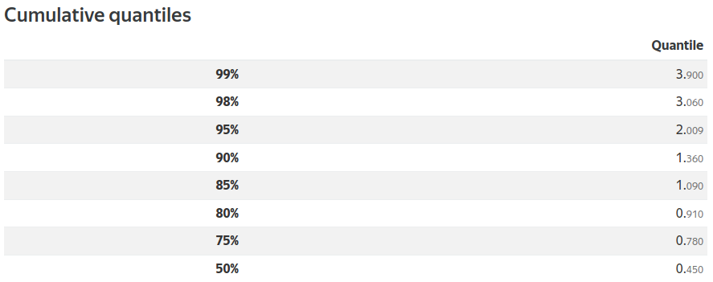

#### 12000 RPS

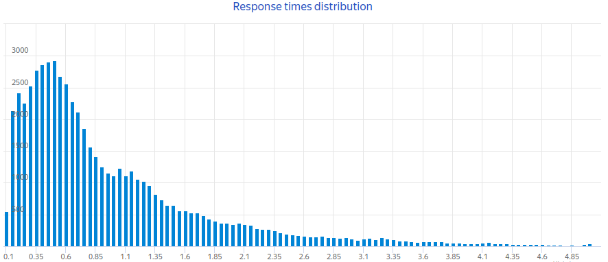
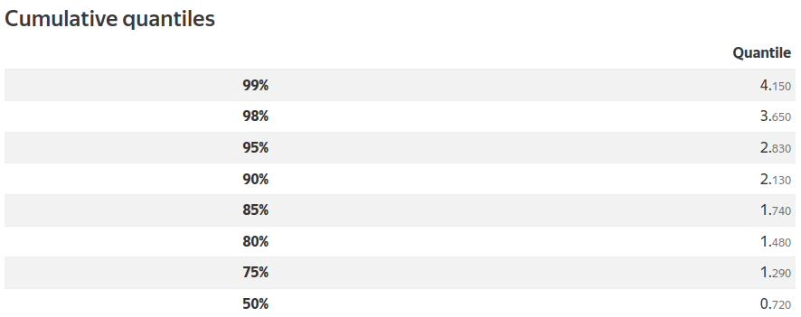

#### 14000 RPS

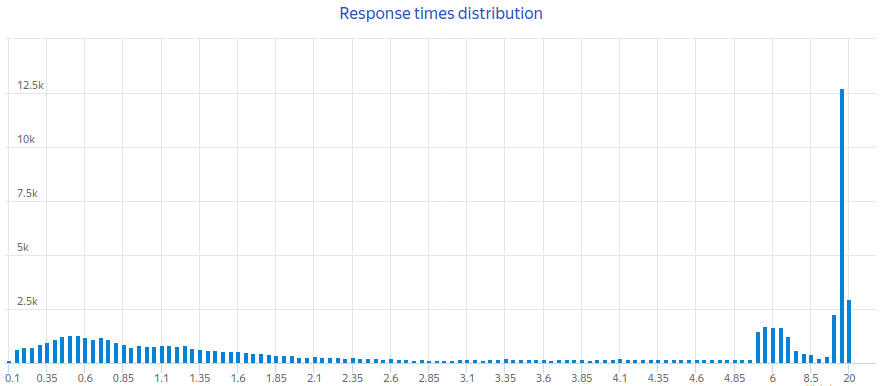


### Tarantool

[https://github.com/tarantool](https://github.com/tarantool)

- Был сделан Mail.ru под свои нужды
- Mail.ru - большая интернет-компания, а у большой интернет-компании большие нагрузки
- Это in-memory решение

| Event                              |   Nanoseconds | Microseconds | Milliseconds | Comparison                  |
|------------------------------------|--------------:|-------------:|-------------:|-----------------------------|
| L1 cache reference                 |           0.5 |            - |            - | -                           |
| Branch mispredict                  |           5.0 |            - |            - | -                           |
| L2 cache reference                 |           7.0 |            - |            - | 14x L1 cache                |
| Mutex lock/unlock                  |          25.0 |            - |            - | -                           |
| Main memory reference              |         100.0 |            - |            - | 20x L2 cache, 200x L1 cache |
| Compress 1K bytes with Zippy       |       3,000.0 |            3 |            - | -                           |
| Send 1K bytes over 1 Gbps network  |      10,000.0 |           10 |            - | -                           |
| Read 4K randomly from SSD          |     150,000.0 |          150 |            - | ~1GB/sec SSD                |
| Read 1 MB sequentially from memory |     250,000.0 |          250 |            - | -                           |
| Round trip within same datacenter  |     500,000.0 |          500 |            - | -                           |
| Read 1 MB sequentially from SSD    |   1,000,000.0 |        1,000 |            1 | ~1GB/sec SSD, 4X memory     |
| Disk seek                          |  10,000,000.0 |       10,000 |           10 | 20x datacenter roundtrip    |
| Read 1 MB sequentially from disk   |  20,000,000.0 |       20,000 |           20 | 80x memory, 20X SSD         |
| Send packet CA → Netherlands → CA  | 150,000,000.0 |      150,000 |          150 | -                           |

[https://gist.github.com/jboner/2841832](https://gist.github.com/jboner/2841832)

#### Хранение сессий

- Пользователь делает вход в систему
- Система отдает пользователю токен
- Внутри системы по этому токену сохраняется сессия
- Пользователь по токену получает доступ
- В случае истечения сессии пользователь должен снова выполнить вход
- Пользователей более 100 миллионов

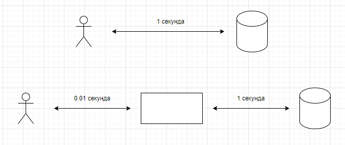

Систему можно ускорить, если перед медленным компонентом поставить кеш:

- Если данных нет в кеше, то выполняется запрос в медленный компонент и результат сохраняется для будущих запросов
- Если данные в кеше есть, то они возвращаются на запрос и к медленному компоненту обращений нет

#### Проблема холодного старта

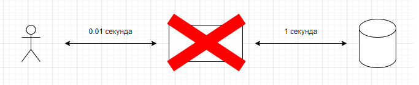

- При старте кеша придется делать запросы к медленному компоненту, пока кеш не будет заполнен (прогрев кеша)
- Это означает резко возросшее число запросов, что кроме снижения времени обслуживания, может привести медленный компонент к отказу

#### Кеш может сохранять состояние

- Ответы к медленному компоненту дублируем в виде записи на диск
- При старте загружаем состояние с диска

#### Удаление сессий

- Пользователь выходит из системы, сессия удаляется из кеша
- Сессия удаляется, если вышло ее время жизни

Дополнительные условия:

- Не только удалять сессию, а еще и перекладывать ее в отдельный сервис
- Этот сервис будет удалять всю информацию о пользователе, если он не делал вход в систему более 2 лет

#### Хранимые процедуры

- Добавляем возможность по событию выполнить код

#### Дальше больше

- Репликация
- Индексы
- Вторичные индексы
- Полноценный сервис приложений

### Tarantool сегодня

Платформа in-memory вычислений с гибкой схемой данных для эффективного создания высоконагруженных приложений

#### Архитектура

- Данные находятся в памяти
- Данные представлены в виде кортежей
- Доступ к данным из одного потока
- Транзакции
- Изменения пишутся на диск (Write Ahead Log, WAL)
- К данным строятся индексы
- Сохраняются snapshot'ы
- WAL реплицируется
- Исполнение пользовательского кода с помощью LuaJIT
- Кооперативная многозадачность

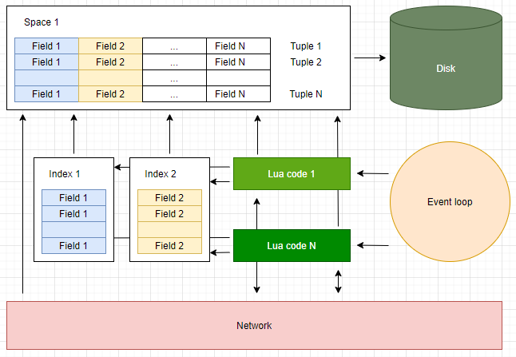

### Lua

```lua
-- Два дефиса начинают однострочный комментарий.

--[[
    Добавление двух квадратных скобок
    делает комментарий многострочным.
--]]
--------------------------------------------------------------------------------
-- 1. Переменные, циклы и условия.
--------------------------------------------------------------------------------

num = 42  -- Все числа имеют тип double.
-- Не волнуйтесь, в 64-битных double 52 бита
-- отведено под хранение целой части числа;
-- точность не является проблемой для
-- целочисленных значений, занимающих меньше 52 бит.

s = 'walternate'  -- Неизменные строки, как в Python.
t = "Двойные кавычки также приветствуются"
u = [[ Двойные квадратные скобки
       начинают и заканчивают
       многострочные значения.]]
t = nil  -- Удаляет определение переменной t; в Lua есть сборка мусора.

-- Блоки обозначаются ключевыми словами, такими как do/end:
while num < 50 do
  num = num + 1  -- Операторов ++ и += нет.
end

-- Ветвление "если":
if num > 40 then
  print('больше 40')
elseif s ~= 'walternate' then  -- ~= обозначает "не равно".
  -- Проверка равенства это ==, как в Python; работает для строк.
else
  -- По умолчанию переменные являются глобальными.
  this_is_global = 5

  -- Как сделать переменную локальной:
  local line = 6

  -- Для конкатенации строк используется оператор .. :
  print('Зима пришла, ' .. line)
end

-- Неопределённые переменные возвращают nil.
-- Этот пример не является ошибочным:
foo = an_unknown_variable  -- Теперь foo = nil.

a_bool_value = false

-- Только значения nil и false являются ложными; 0 и '' являются истинными!
if not a_bool_value then print('это значение ложно') end

-- Для 'or' и 'and' действует принцип "какой оператор дальше,
-- тот и применяется". Это действует аналогично оператору a ? b : c в C/JS:
ans = a_bool_value and 'yes' or 'no'  --> 'no'

karl_sum = 0
for i = 1, 100 do  -- Здесь указан диапазон, ограниченный с двух сторон.
  karl_sum = karl_sum + i
end

-- Используйте "100, 1, -1" как нисходящий диапазон:
fred_sum = 0
for j = 100, 1, -1 do fred_sum = fred_sum + j end

-- В основном, диапазон устроен так: начало, конец[, шаг].

-- Другая конструкция цикла:
repeat
  print('путь будущего')
  num = num - 1
until num == 0

--------------------------------------------------------------------------------
-- 2. Функции.
--------------------------------------------------------------------------------

function fib(n)
  if n < 2 then return n end
  return fib(n - 2) + fib(n - 1)
end

-- Вложенные и анонимные функции являются нормой:
function adder(x)
  -- Возвращаемая функция создаётся, когда вызывается функция adder,
  -- и запоминает значение переменной x:
  return function (y) return x + y end
end
a1 = adder(9)
a2 = adder(36)
print(a1(16))  --> 25
print(a2(64))  --> 100

-- Возвраты, вызовы функций и присвоения работают со списками,
-- которые могут иметь разную длину.
-- Лишние получатели принимают значение nil, а лишние значения игнорируются.

x, y, z = 1, 2, 3, 4
-- Теперь x = 1, y = 2, z = 3, а 4 просто отбрасывается.

function bar(a, b, c)
  print(a, b, c)
  return 4, 8, 15, 16, 23, 42
end

x, y = bar('zaphod')  --> выводит "zaphod  nil nil"
-- Теперь x = 4, y = 8, а значения 15..42 отбрасываются.

-- Функции могут быть локальными и глобальными. Эти строки делают одно и то же:
function f(x) return x * x end
f = function (x) return x * x end

-- Эти тоже:
local function g(x) return math.sin(x) end
local g = function(x) return math.sin(x) end
-- Эквивалентно для local function g(x)..., однако ссылки на g
-- в теле функции не будут работать, как ожидалось.
local g; g = function (x) return math.sin(x) end
-- 'local g' будет прототипом функции.

-- Кстати, тригонометрические функции работают с радианами.

-- Вызов функции с одним строковым параметром не требует круглых скобок:
print 'hello'  -- Работает без ошибок.

-- Вызов функции с одним табличным параметром также
-- не требует круглых скобок (про таблицы в след. части):
print {} -- Тоже сработает.

--------------------------------------------------------------------------------
-- 3. Таблицы.
--------------------------------------------------------------------------------

-- Таблица = единственная составная структура данных в Lua;
-- представляет собой ассоциативный массив.
-- Подобно массивам в PHP или объектам в JS, они представляют собой
-- хеш-таблицы, которые также можно использовать в качестве списков.


-- Использование словарей:

-- Литералы имеют ключ по умолчанию:
t = {key1 = 'value1', key2 = false}

-- Строковые ключи используются, как в точечной нотации в JS:
print(t.key1)  -- Печатает 'value1'.
t.new_key = {} -- Добавляет новую пару ключ/значение.
t.key2 = nil   -- Удаляет key2 из таблицы.

-- Литеральная нотация для любого значения ключа (кроме nil):
u = {['@!#'] = 'qbert', [{}] = 1729, [6.28] = 'tau'}
print(u[6.28])  -- пишет "tau"

-- Ключ соответствует значению для чисел и строк, но при
-- использовании таблицы в качестве ключа берётся её экземпляр.
a = u['@!#']  -- Теперь a = 'qbert'.
b = u[{}]     -- Вы могли ожидать 1729, но получится nil:
-- b = nil, т.к. ключ не будет найден.
-- Это произойдёт потому, что за ключ мы использовали не тот же самый объект,
-- который был использован для сохранения оригинального значения.
-- Поэтому строки и числа удобнее использовать в качестве ключей.

-- Вызов функции с одной таблицей в качестве аргумента
-- не требует круглых скобок:
function h(x) print(x.key1) end
h{key1 = 'Sonmi~451'}  -- Печатает 'Sonmi~451'.

for key, val in pairs(u) do  -- Цикл по таблице.
  print(key, val)
end

-- _G - это таблица со всеми глобальными переменными.
print(_G['_G'] == _G)  -- Печатает 'true'.

-- Использование таблиц, как списков/массивов:

-- Список значений с неявно заданными целочисленными ключами:
v = {'value1', 'value2', 1.21, 'gigawatts'}
for i = 1, #v do  -- #v - размер списка v.
  print(v[i])  -- Нумерация начинается с 1!
end

-- Список не является отдельным типом. v - всего лишь таблица
-- с последовательными целочисленными ключами, воспринимаемая как список.

--------------------------------------------------------------------------------
-- 3.1 Метатаблицы и метаметоды.
--------------------------------------------------------------------------------

-- Таблицу можно связать с метатаблицей, задав ей поведение, как при
-- перегрузке операторов. Позже мы увидим, что метатаблицы поддерживают
-- поведение, как в JS-прототипах.
f1 = {a = 1, b = 2}  -- Представляет дробь a/b.
f2 = {a = 2, b = 3}

-- Это не сработает:
-- s = f1 + f2

metafraction = {}
function metafraction.__add(f1, f2)
  local sum = {}
  sum.b = f1.b * f2.b
  sum.a = f1.a * f2.b + f2.a * f1.b
  return sum
end

setmetatable(f1, metafraction)
setmetatable(f2, metafraction)

s = f1 + f2  -- вызвать __add(f1, f2) на метатаблице от f1

-- f1, f2 не имеют ключа для своих метатаблиц в отличии от прототипов в JS,
-- нужно получить его через getmetatable(f1). Метатаблица - обычная таблица
-- с ключами, известными для Lua (например, __add).

-- Но следующая строка будет ошибочной т.к в s нет метатаблицы:
-- t = s + s
-- Похожий на классы подход, приведенный ниже, поможет это исправить.

-- __index перегружает в метатаблице просмотр через точку:
defaultFavs = {animal = 'gru', food = 'donuts'}
myFavs = {food = 'pizza'}
setmetatable(myFavs, {__index = defaultFavs})
eatenBy = myFavs.animal  -- работает! спасибо, мета-таблица.

--------------------------------------------------------------------------------
-- При неудаче прямой табличный поиск попытается использовать
-- значение __index в метатаблице, причём это рекурсивно.

-- Значение __index также может быть функцией
-- function(tbl, key) для настраиваемого поиска.

-- Значения типа __index, __add, ... называются метаметодами.
-- Ниже приведён полный список метаметодов.

-- __add(a, b)                          для a + b
-- __sub(a, b)                          для a - b
-- __mul(a, b)                          для a * b
-- __div(a, b)                          для a / b
-- __mod(a, b)                          для a % b
-- __pow(a, b)                          для a ^ b
-- __unm(a)                             для -a
-- __concat(a, b)                       для a .. b
-- __len(a)                             для #a
-- __eq(a, b)                           для a == b
-- __lt(a, b)                           для a < b
-- __le(a, b)                           для a <= b
-- __index(a, b) <функция или таблица>  для a.b
-- __newindex(a, b, c)                  для a.b = c
-- __call(a, ...)                       для a(...)

--------------------------------------------------------------------------------
-- 3.2 Классоподобные таблицы и наследование.
--------------------------------------------------------------------------------

-- В Lua нет поддержки классов на уровне языка,
-- однако существуют разные способы их создания с помощью
-- таблиц и метатаблиц.

-- Ниже приведён один из таких способов.

Dog = {}                                    -- 1.

function Dog:new()                          -- 2.
  local new_obj = {sound = 'woof'}          -- 3.
  self.__index = self                       -- 4.
  return setmetatable(new_obj, self)        -- 5.
end

function Dog:make_sound()                   -- 6.
  print('I say ' .. self.sound)
end

mrDog = Dog:new()                           -- 7.
mrDog:make_sound()  -- 'I say woof'         -- 8.

-- 1. Dog похоже на класс, но на самом деле это таблица.
-- 2. "function tablename:fn(...)" - то же самое, что и
--    "function tablename.fn(self, ...)", просто : добавляет первый аргумент
--    перед собой. См. пункты 7 и 8, чтобы понять, как self получает значение.
-- 3. new_obj - это экземпляр класса Dog.
-- 4. "self" - экземпляр класса. Зачастую self = Dog, но с помощью наследования
--    это можно изменить. new_obj получит свои функции, когда мы установим
--    метатаблицу для new_obj и __index для self на саму себя.
-- 5. Напоминание: setmetatable возвращает первый аргумент.
-- 6. : работает, как в пункте 2, но в этот раз мы ожидаем,
--    что self будет экземпляром, а не классом.
-- 7. То же самое, что и Dog.new(Dog), поэтому self = Dog в new().
-- 8. То же самое, что mrDog.make_sound(mrDog); self = mrDog.
--------------------------------------------------------------------------------

-- Пример наследования:

LoudDog = Dog:new()                           -- 1.

function LoudDog:make_sound()
  local s = self.sound .. ' '                 -- 2.
  print(s .. s .. s)
end

seymour = LoudDog:new()                       -- 3.
seymour:make_sound()  -- 'woof woof woof'      -- 4.

--------------------------------------------------------------------------------
-- 1. LoudDog получит методы и переменные класса Dog.
-- 2. В self будет ключ 'sound' из new(), см. пункт 3.
-- 3. То же самое, что и "LoudDog.new(LoudDog)", конвертированное
--    в "Dog.new(LoudDog)", поскольку в LoudDog нет ключа 'new',
--    но в его метатаблице есть "__index = Dog".
--    Результат: Метатаблицей для seymour стала LoudDog,
--    а "LoudDog.__index = Dog". Поэтому seymour.key будет равно
--    seymour.key, LoudDog.key, Dog.key, в зависимости от того,
--    какая таблица будет первой с заданным ключом.
-- 4. Ключ 'make_sound' находится в LoudDog;
--    то же самое, что и "LoudDog.make_sound(seymour)".

-- При необходимости функция new() в подклассе
-- может быть похожа на аналог в базовом классе.
function LoudDog:new()
  local new_obj = {}
  -- установить new_obj
  self.__index = self
  return setmetatable(new_obj, self)
end

--------------------------------------------------------------------------------
-- 4. Модули.
--------------------------------------------------------------------------------


--[[ Я закомментировал этот раздел, чтобы остальная часть скрипта осталась
--   работоспособной.
-- Предположим, файл mod.lua будет выглядеть так:
local M = {}

local function say_my_name()
  print('Hrunkner')
end

function M.say_hello()
  print('Привет, ')
  say_my_name()
end

return M

-- Другой файл может использовать функционал mod.lua:
local mod = require('mod')  -- Запустим файл mod.lua.

-- require - стандартный способ подключения модулей.
-- require ведёт себя так:     (если не кэшировано, см. ниже)
local mod = (function ()
  <содержимое mod.lua>
end)()
-- Файл mod.lua воспринимается, как тело функции, поэтому
-- все локальные переменные и функции внутри него не видны за его пределами.

-- Это работает, так как здесь mod = M в mod.lua:
mod.say_hello()  -- Выведет "Привет, Hrunkner".

-- Это будет ошибочным; say_my_name доступна только в mod.lua:
mod.say_my_name()  -- ошибка

-- Значения, возвращаемые require, кэшируются,
-- поэтому содержимое файла выполняется только 1 раз,
-- даже если он подключается с помощью require много раз.

-- Предположим, mod2.lua содержит "print('Hi!')".
local a = require('mod2')  -- Выведет "Hi!"
local b = require('mod2')  -- Ничего не выведет; a=b.

-- dofile, в отличии от require, работает без кэширования:
dofile('mod2')  --> Hi!
dofile('mod2')  --> Hi! (запустится снова)

-- loadfile загружает файл, но не запускает его.
f = loadfile('mod2')  -- Вызов f() запустит содержимое mod2.lua.

-- loadstring - это loadfile для строк.
g = loadstring('print(343)')  -- Вернет функцию.
g()  -- Напишет 343.

--]]
```

[https://learnxinyminutes.com/docs/ru-ru/lua-ru/](https://learnxinyminutes.com/docs/ru-ru/lua-ru/)

### Установка Tarantool

[https://www.tarantool.io/ru/download/](https://www.tarantool.io/ru/download/)

### Установка модулей (rocks)

[https://github.com/tarantool/http](https://github.com/tarantool/http)

```
tarantoolctl rocks install http
```

### Application server

```lua
local function hello()
    return {
        status = 200,
        body = 'hello, world'
    }
end

local router = require('http.router').new()
router:route({ method = 'GET', path = '/hello' }, hello)

local server = require('http.server').new('localhost', 9000)
server:set_router(router)

server:start()
```

### Database

[https://www.tarantool.io/en/doc/latest/reference/reference_lua/box/](https://www.tarantool.io/en/doc/latest/reference/reference_lua/box/)

**users.lua**

```lua
local clock = require('clock')
local digest = require('digest')

local function get_space()
    local space = box.space.users
    if space ~= nil then
        return space
    end

    box.begin()

    space = box.schema.space.create('users')

    space:format({
        { name = 'email',       type = 'string',    is_nullable = false },
        { name = 'name',        type = 'string',    is_nullable = false },
        { name = 'password',    type = 'string',    is_nullable = false },
        { name = 'created_at',  type = 'unsigned',  is_nullable = false },
        { name = 'last_login',  type = 'unsigned',  is_nullable = true }
    })

    space:create_index('email', {
        type = 'HASH',
        unique = true,
        if_not_exists = true,
        parts = {{ field = 'email', type = 'string', collation = 'unicode_ci' }}
    })

    box.commit()

    return space
end

local function get_password_hash(password)
    local salt = 'C9DFB8DADFDA4F8EBD4EA545ACD4197B'
    return digest.sha512_hex(password .. salt)
end

local function add(email, name, password)
    if email == nil or name == nil or password == nil then
        return nil, 'invalid usage'
    end

    local space = get_space()

    local user_info, err = space:insert({
        email,
        name,
        get_password_hash(password),
        clock.time64(),
        box.NULL
    })

    if err ~= nil then
        return nil, "can't add user: " .. err
    end

    user_info = user_info:tomap({ names_only = true })
    user_info.password = nil
    return user_info
end

local function login(email, password)
    if email == nil or password == nil then
        return nil, 'invalid usage'
    end

    local space = get_space()

    local user_info = space:get(email)
    if user_info == nil then
        return nil, 'unknown user'
    end

    if get_password_hash(password) ~= user_info.password then
        return nil, 'password mismatch'
    end

    user_info = space:update(email, {{ '=', 'last_login', clock.time64() }})
    user_info = user_info:tomap({ names_only = true })
    user_info.password = nil
    return user_info
end

return {
    add = add,
    login = login
}
```

**init.lua**

```lua
local json = require('json')
local users = require('users')

local function make_response(code, body)
    return {
        status = code,
        headers = { ['content-type'] = 'application/json; charset=utf-8' },
        body = json.encode(body)
    }
end

local function add(req)
    local ok, user_info = pcall(json.decode, req:read())
    if ok ~= true then
        return make_response(400, { error = user_info })
    end

    if user_info.email == nil
        or user_info.name == nil
        or user_info.password == nil
    then
        return make_response(400, { error = 'invalid usage' })
    end

    local ok, user_info, err = pcall(users.add,
        user_info.email, user_info.name, user_info.password)

    if ok ~= true then
        return make_response(500, { error = user_info })
    end

    if err ~= nil then
        return make_response(400, { error = err })
    end

    return make_response(201, user_info)
end

local function login(req)
    local email = req:query_param('email')
    local password = req:query_param('password')

    if email == nil or password == nil then
        return make_response(400, { error = 'invalid usage' })
    end

    local ok, user_info, err = pcall(users.login, email, password)

    if ok ~= true then
        return make_response(500, { error = user_info })
    end

    if err ~= nil then
        return make_response(400, { error = err })
    end

    return make_response(200, user_info)
end

box.cfg()

local router = require('http.router').new()
router:route({ method = 'POST', path = '/add' }, add)
router:route({ method = 'GET', path = '/login' }, login)

local server = require('http.server').new('localhost', 9000)
server:set_router(router)

server:start()
```

```bash
curl -X POST -d '{"email": "test@mail.ru", "name": "Ivan", "password": "mypass"}' http://localhost:9000/add
```

```bash
curl "http://localhost:9000/login?email=test@mail.ru&name=test&password=mypass"
```

### Fibers

[https://www.tarantool.io/en/doc/latest/reference/reference_lua/fiber/](https://www.tarantool.io/en/doc/latest/reference/reference_lua/fiber/)

- Файберы выполняются в 1 потоке
- Если файбер завершает работу или явно передает управление через fiber.yield(), то другой файбер получает управление
- Также файберы неявно передают управление на некоторых функциях, например, ввода-вывода
- Если файбер не передает управление, то остальные файберы не будут ничего делать

**users.lua**

```lua
local validation = require('validation')

...

local function add(email, name, password)
    ...

    user_info = user_info:tomap({ names_only = true })
    user_info.password = nil

    validation.process(user_info) -- асинхронная задача подтверждения email

    return user_info
end
```

**validation.lua**

```lua
local fiber = require('fiber')

local function get_space()
    local space = box.space.validation_queue
    if space ~= nil then
        return space
    end

    box.begin()

    space = box.schema.space.create('validation_queue')

    space:format({
        { name = 'email',   type = 'string',    is_nullable = false }
    })

    space:create_index('email', {
        type = 'HASH',
        unique = true,
        if_not_exists = true,
        parts = {{ field = 'email', type = 'string', collation = 'unicode_ci' }}
    })

    box.commit()

    return space
end

local function start_worker(has_job)
    while true do
        local space = get_space()

        for _, email in get_space():pairs() do
            print(email)
            space:delete(email)
        end

        has_job:wait()
    end
end

local has_job = fiber.cond()

fiber.create(start_worker, has_job)

local function process(user_info)
    local space = get_space()
    space:insert({ user_info.email })
    has_job:signal()
end

return {
    process = process
}
```
