### Сети

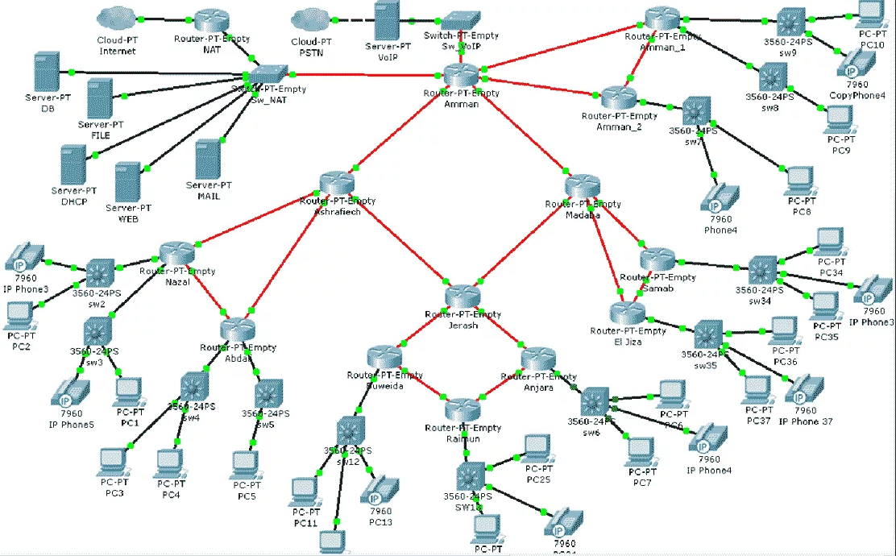

### Сетевые протоколы

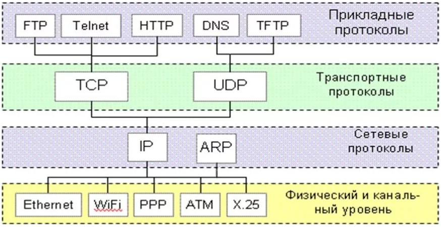

### Ethernet


EtherType - тип протокола следующего уровня: IPv4 - 0x0800, IPv6 - 86DD, ARP - 0x0806

### MAC (Media Access Control)

Уникальный идентификатор, присваиваемый каждой единице активного оборудования или некоторым их интерфейсам в компьютерных сетях Ethernet (также Hardware Address, также физический адрес)

- Состоит из шести байт, обычно отображаемых в шестнадцатеричном формате
- Присваевается сетевой карте производителем
- Состоит из части идентификатора производителя OUI (Organizationally Unique Identifier) и идентификатора присваиваемого производителем

#### Локальная сеть

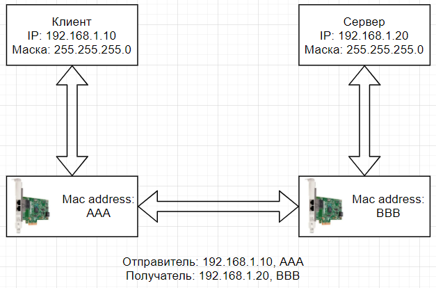

1. Клиент собирается отправить пакет на адрес 192.168.1.10
2. Чтобы отделить номер сети от номера компьютера, применяется маска подсети логическим умножением (AND)
3. Используя маску подсети клиент сравнивает адрес сервера со своим и видит, что они находятся в одной сети
4. Для передачи пакета используется ARP-протокол

#### ARP (Address Resolution Protocol)

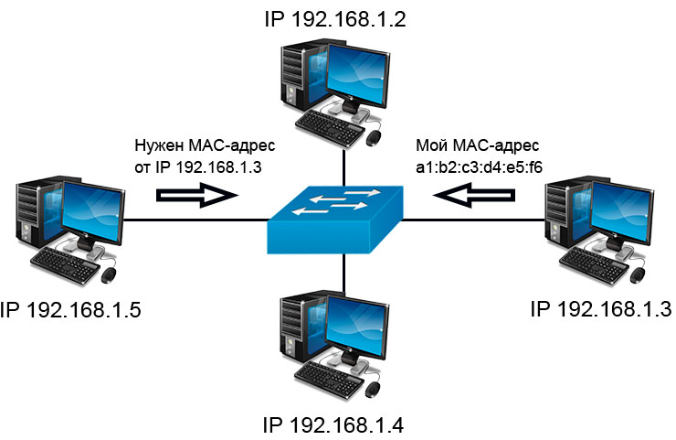

Протокол по которому определяется MAC-адрес узла по его IP-адресу, не проходит через маршрутизаторы

1. Компьютер отправляет широковещательный запрос всем участникам локальной сети
2. Запрос содержит IP-адрес требуемого компьютера и собственный MAC-адрес
3. Все компьютеры извлекают и запоминают IP и MAC-адреса отправителя запроса
4. Компьютер с указанным IP-адресом, понимает, что запрос пришел к нему и в ответ высылает свой MAC-адрес на тот, который пришел в запросе

##### ARP-таблица

```
Protocol  Address          Age (min)  Hardware Addr   Type   Interface
Internet  192.168.1.1             -   0060.5C16.3B01  ARPA   FastEthernet0/0
Internet  192.168.1.2             6   00E0.F73D.E561  ARPA   FastEthernet0/0
Internet  192.168.2.1             -   0060.5C16.3B02  ARPA   FastEthernet0/1
Internet  192.168.2.2             7   0002.179D.455A  ARPA   FastEthernet0/1
```

#### Router, switch, hub

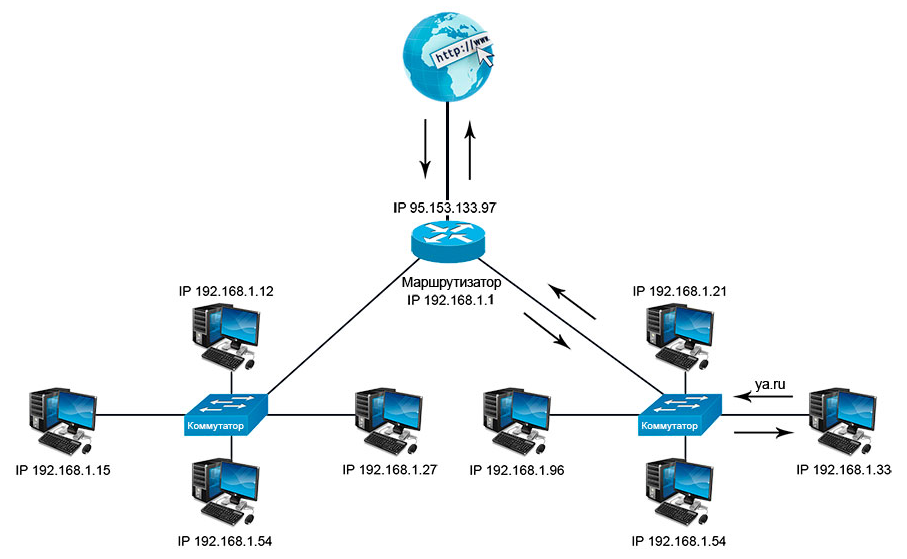

##### Switch (коммутатор)


- Предназначен для объединения узлов в пределах одного или нескольких сегментов сети
- Хранит в памяти таблицу коммутации, в которой указывается соответствие MAC-адреса узла порту коммутатора
- Отсылает пакеты данных конкретному получателю

##### Hub

- Предназначен для объединения узлов в пределах одного или нескольких сегментов сети
- Отсылает пакеты данных на все узлы
- Вытеснен свичами

##### Router (маршрутизатор)


- Пересылает пакеты, в том числе между разными сегментами сети
- Принимает решения по отправке пакетов на основании правил, заданных при настройке и топологии сети
- Как правило имеет возможность настройки Firewall, DHCP, NAT, и т.д.

##### Таблица маршрутизации

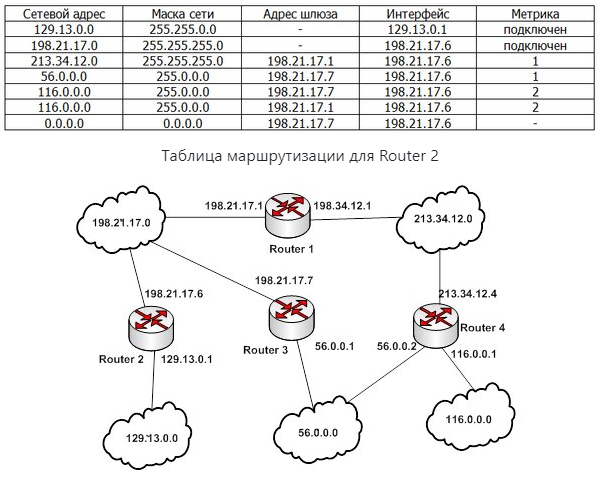

> Чем меньше metric, тем предпочтительней маршрут

#### NAT (Network Address Translation)/PAT (Port Address Translation)

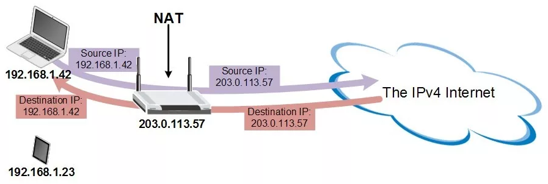

- Позволяет сэкономить IP-адреса транслируя несколько внутренних IP-адресов в один внешний публичный IP-адрес
- Скрывает внутреннюю структуру сети
- Нет возможности из вне создать подключение к хосту за NAT
- Некоторые протоколы не работают или работают плохо
- Сложности с идентификацией пользователей (с вашего IP уже было соединение)

#### Несколько сетей

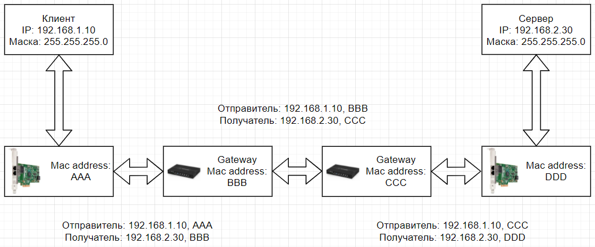

1. Клиент собирается отправить пакет на адрес 192.168.2.30, сравнивая адрес сервера со своим он видит, что они находятся в разных сетях, значит нужно отправить пакет на MAC-адрес шлюза (gateway)
2. Клиент создаёт пакет, указывая в нём в качестве IP отправителя свой адрес – 191.168.1.10, а в качестве IP получателя адрес сервера – 192.168.2.30
3. Пакет заворачивается во фрейм, в котором MAC-адрес отправителя AAA, а в качестве MAC-адреса получателя стоит адрес шлюза – BBB
4. Шлюз-маршрутизатор по MAC BBB понимает, что фрейм ему, достаёт из него пакет и согласно своей таблице маршрутизации, принимает решение о пересылке дальше
5. Маршрутизатор запаковывает тот же пакет но в новый фрейм с MAC отправителя – BBB, MAC получателя – CCC, содержимое заголовка IP пакета не меняется – в нём по-прежнему адрес отправителя 192.168.1.10, а адрес получателя – 192.168.2.30
6. Другой маршрутизатор получает фрейм, по MAC определяет, что фрейм предназначается ему, распаковывает и обработатывает фрейм
7. Из фрейма извлекается IP пакет. Из адреса получателя видно, что пакет идёт в сеть 192.168.2.x, которая непосредственно подключена к этому шлюзу-маршрутизатору
8. Пакет переупаковывается в новый фрейм в котором MAC-адрес отправителя CCC, а в качестве MAC-адреса получателя стоит DDD
9. Фрейм отправляется в последнюю локальную сеть 192.168.3.x
10. Сервер получает фрейм, по MAC (DDD) определяет, что это фрейм для него, распаковывает фрейм и достаёт из него пакет, в пакете его IP (192.168.2.30), значит можно передать фрейм локально на обработку

### IP (Internet Protocol)

- Без гарантии доставки
- Без сохранения порядка следования сообщений

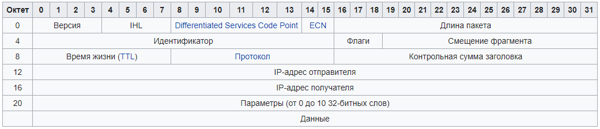

- Время жизни (TTL, Time To Live) – максимальное время, в течение которого пакет может перемещаться по сети. Введено для предотвращения «бесконечного» продвижения пакетов. Каждый маршрутизатор уменьшает значение на 1
- Протокол: TCP – 6, UDP – 17, ICMP – 1

### Протокол ICMP (Internet Control Message Protocol)

Так как протокол IP предоставляет сервис передачи данных без гарантии доставки, то в случае ошибки при передаче пакета никаких действий не предпринимается

- Оповещение об ошибках на сетевом уровне
- Тестирование работоспособности сети

#### Тестирование работы сети:

##### ping

Проверка доступности компьютера в сети:
- Эхо-запрос
- Эхо-ответ

```
ping 127.0.0.1
```

```
PING 127.0.0.1 (127.0.0.1): 56 data bytes
64 bytes from 127.0.0.1: icmp_seq=0 ttl=64 time=0.074 ms
64 bytes from 127.0.0.1: icmp_seq=1 ttl=64 time=0.043 ms
^C
--- 127.0.0.1 ping statistics ---
2 packets transmitted, 2 packets received, 0.0% packet loss
round-trip min/avg/max/stddev = 0.043/0.058/0.074/0.015 ms
```

##### traceroute

- Определяет маршрут от отправителя к получателю (делает серию запроса с ttl=1 постепенно увеличивая значение)
- Находит адреса всех маршрутизаторов, через которые проходит пакет

```
traceroute ya.ru
```

```
traceroute to ya.ru (87.250.250.242), 64 hops max, 52 byte packets
 1  gpon.net (192.168.1.1)  2.400 ms  1.807 ms  1.163 ms
 2  100.94.0.1 (100.94.0.1)  3.039 ms  3.555 ms  2.734 ms
 3  mpts-a197-51.msk.mts-internet.net (212.188.1.106)  5.434 ms  4.421 ms  5.173 ms
 4  a197-cr04-be12.51.msk.mts-internet.net (212.188.1.105)  13.603 ms  4.434 ms  4.396 ms
 5  212.188.33.199 (212.188.33.199)  3.856 ms  3.797 ms  3.721 ms
 6  10.4.6.1 (10.4.6.1)  145.973 ms * *
 7  ya.ru (87.250.250.242)  14.935 ms  7.382 ms  7.348 ms
```

### Ручная установка IP

```bash
ip addr show
```

```bash
ip a
```

```
lo0: flags=8049<UP,LOOPBACK,RUNNING,MULTICAST> mtu 16384
	inet 127.0.0.1/8 lo0
	inet6 ::1/128
	inet6 fe80::1/64 scopeid 0x1
en0: flags=8863<UP,BROADCAST,SMART,RUNNING,SIMPLEX,MULTICAST> mtu 1500
	ether 8c:85:90:7f:de:62
	inet 192.168.1.8/24 brd 192.168.1.255 en0
```

> lo0 - loopback - виртуальный сетевой интерфейс, любой трафик посланный на него возвращается обратно
> inet - ip v4
> inet6 - ip v6
> ether - ethernet, он же mac-адрес

```bash
ip addr add 192.168.1.88 dev en0
```

```bash
ip addr del 192.168.1.88 dev en0
```

### DHCP (Dynamic Host Configuration Protocol)

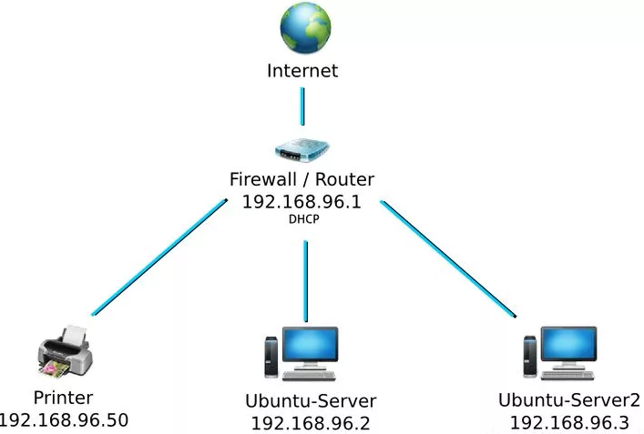

Сетевой протокол, позволяющий сетевым устройствам автоматически получать IP-адрес и другие параметры, необходимые для работы в сети TCP/IP. Требуется DHCP сервер

### DNS (Domain Name System)

Система DNS позволяет преобразовывать имена компьютеров в IP-адреса. Представляет собой распределенное хранилище ключей и значений, если сервер не может предоставить значение по ключу, то происходит делегирование другому серверу

```
ya.ru -> 87.250.250.242
```

##### /etc/hosts

```
# Host Database
#
# localhost is used to configure the loopback interface
# when the system is booting.  Do not change this entry.
##
127.0.0.1	localhost
255.255.255.255	broadcasthost
::1             localhost
# Added by Docker Desktop
# To allow the same kube context to work on the host and the container:
127.0.0.1 kubernetes.docker.internal
# End of section
```

##### Система DNS

- Нет единого сервера, на котором описываются имена хостов
- Пространство имен разделено на отдельные части – домены
- За каждый домен отвечает отдельная организация
- Распределением доменных имен занимаются регистраторы
- Регистратор корневого домена один - Internet Corporation for Assigned Names and Numbers (ICAN)

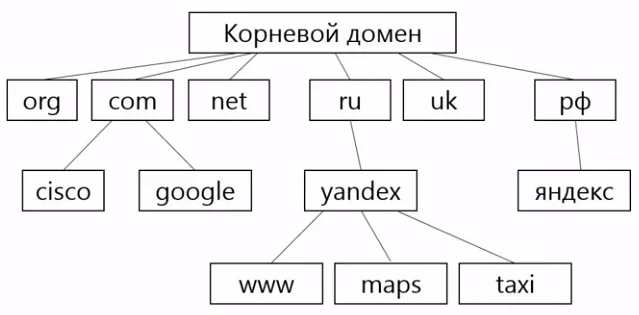

```
dig ya.ru
```

```
;; QUESTION SECTION:
;ya.ru.				IN	A

;; ANSWER SECTION:
ya.ru.			128	IN	A	87.250.250.242
```

Имя хоста

Время сколько нужно держать значение в кеше перед повторным запросом, секунд (TTL)

Класс записи - в каких сетях используется:
- IN - Интернет

Типы записей для IP-адресов:
- A - IPv4 адрес компьютера
- AAAA - IPv6 адрес компьютера
- NS - имя следующего DNS сервера

Адрес хоста

```
dig +trace ya.ru
```

```
.			81982	IN	NS	j.root-servers.net.
.			81982	IN	NS	h.root-servers.net.
.			81982	IN	NS	c.root-servers.net.
.			81982	IN	NS	k.root-servers.net.
.			81982	IN	NS	e.root-servers.net.
.			81982	IN	NS	a.root-servers.net.
.			81982	IN	NS	b.root-servers.net.
.			81982	IN	NS	d.root-servers.net.
.			81982	IN	NS	l.root-servers.net.
.			81982	IN	NS	f.root-servers.net.
.			81982	IN	NS	i.root-servers.net.
.			81982	IN	NS	g.root-servers.net.
.			81982	IN	NS	m.root-servers.net.

ru.			172800	IN	NS	a.dns.ripn.net.
ru.			172800	IN	NS	b.dns.ripn.net.
ru.			172800	IN	NS	d.dns.ripn.net.
ru.			172800	IN	NS	e.dns.ripn.net.
ru.			172800	IN	NS	f.dns.ripn.net.

ya.ru.			600	IN	A	87.250.250.242
ya.ru.			7200	IN	NS	ns1.yandex.ru.
ya.ru.			7200	IN	NS	ns2.yandex.ru.
```

##### MX запись

```
dig ya.ru mx
```

```
ya.ru.			3461	IN	MX	10 mx.yandex.ru.
```

Связывает доменное имя с почтовым сервером

##### CNAME запись (canonical name)

```
dig www.ya.ru
```

```
www.ya.ru.		76	IN	CNAME	ya.ru.
ya.ru.			213	IN	A	87.250.250.242
```

- Связывает поддомен с каноническим именем домена
- Можно использовать для создания псевдонимов

##### TXT запись

Любой текст, например, используется для проверки прав на владение доменом сторонними сервисами:

```
_acme-challenge.sub.domain.ru. T4Fk9N0KCLiJelOcXjE_ycCLK8SwVaqAFHYoCt0sEn8
```

### TCP (Transmission Control Protocol)

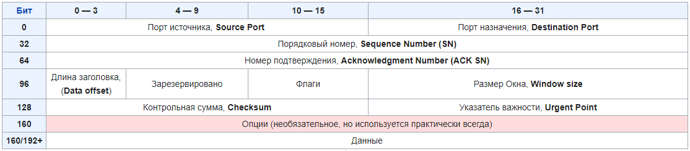

Протокол надежной передачи потока байт:

- Гарантии доставки
- Сохранения порядка следования

Для гарантии доставки TCP использует подтверждение получения данных. Получатель, после приема очередной порции данных, передает отправителю подтверждения о получении. В случае, если подтверждение не пришло, отправитель передает данные еще раз.

Для сохранения порядка следования сообщений используется нумерация сообщений. Нумерация сообщений позволяет расставить перепутанные сегменты в правильном порядке, а также не учитывать дублирующийся сегменты.

#### Зарезервированные номера портов

Port | Protocol
---|---
22 | Secure Shell (SSH)
25 | Простой протокол передачи почты (SMTP)
53 | Система доменных имен (DNS)
80 | Протокол передачи гипертекста (HTTP)
123 | Протокол сетевого времени (NTP)
143 | Internet Message Access Protocol (IMAP)
161 | Простой протокол управления сетью (SNMP)
443 | HTTP Secure (HTTPS)

#### Процесс передачи данных в TCP

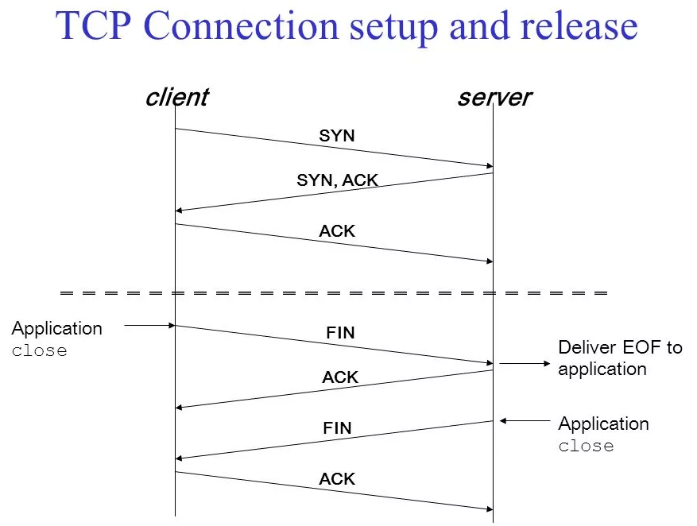

- Установка соединения
	- Отправитель посылает сообщение SYN + номер байта
	- Получатель отвечает сообщением SYN + номер следующего ожидаемого байта, ACK
	- Отправитель посылает сообщение, ACK
	- Соединение установлено
- Передача данных
- Разрыв соединения
	- Соединение в TCP дуплексное
		- Данные могут передаваться в обе стороны
	- Схема разрыва соединения
		- Одновременное (обе стороны разорвали соединение)
		- Одностороннее (одна сторона прекращает передавать данные, но может принимать)
	- Варианты разрыва соединения
		- Одностороннее закрытие (FIN)
			- Отправитель посылает сообщение FIN
			- Получатель отвечает сообщение ACK
			- Получатель посылает сообщение FIN
			- Отправитель посылает сообщение ACK
		- Разрыв из-за критической ситуации (RST)
			- Отправитель посылает сообщение RST

#### Программный интерфейс сокетов

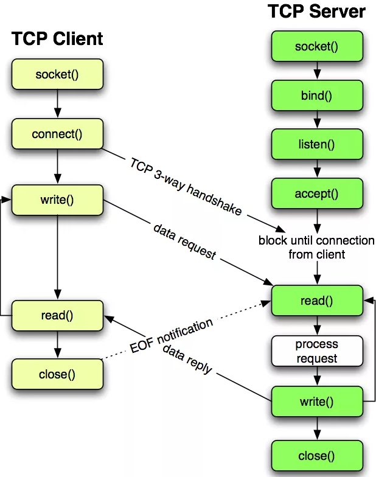

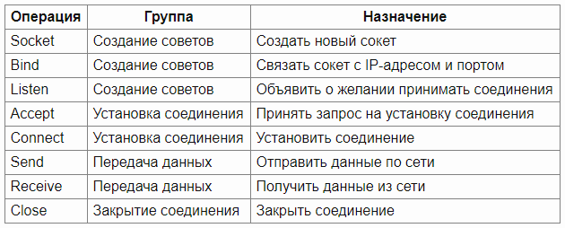

> read = receive
> write = send

### UDP (User Datagram Protocol)

- Нет соединения
- Нет гарантии доставки данных
- Нет гарантии сохранения порядка сообщений

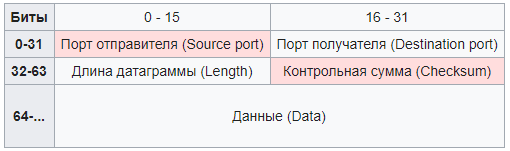

> Розовым выделены поля необязтельные к использованию в IPv4

### TCP vs UDP

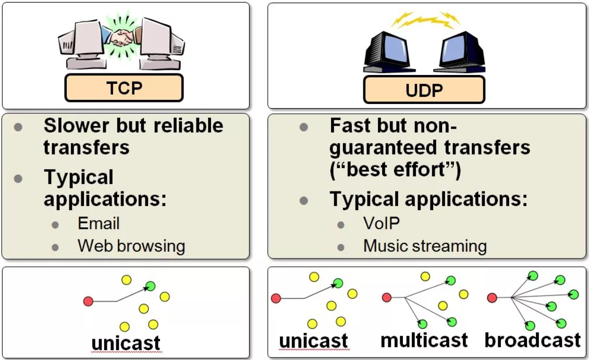

### lsof

```
lsof -i :9000
```

```
COMMAND     PID          USER   FD   TYPE             DEVICE SIZE/OFF NODE NAME
tarantool 10153 m.trempoltcev   12u  IPv6 0xf476a11fe6679cfd      0t0  TCP localhost:cslistener (LISTEN)
```

### Telnet (teletype network)

Сетевой протокол для передачи текстовых сообщений при помощи транспорта TCP

### HTTP (Hypertext Transfer Protocol)

#### URI (Uniform Resource Identifier)

```
протокол://доменное имя/путь
```

```
http://www.example.ru/same/path
https://www.youtube.com/
ftp://example.com
http://www.ietf.org/rfc/rfc959.txt
```

#### Структура запроса и ответа

```
[METHOD] /[RESOURCE] HTTP/[VERSION]
GET / HTTP/1.1
```

```
HTTP/[VERSION] [CODE] [STATUS NAME]
200 ОК.
```

#### Заголовки

```
[HEADER NAME]: [VALUE]
```

```
Host: www.yandex.ru
Content-Type: text/html; charset=UTF-8
Content-Length: 5161
Connection: keep-alive
If-Modified-Since: Wed, 25 May 2016 06:13:24 GMT
```

#### Методы HTTP

Метод HTTP является идемпотентным, если повторный идентичный запрос, сделанный один или несколько раз подряд, имеет один и тот же эффект, не изменяющий состояние сервера

Метод HTTP является безопасным, если не изменяет состояние сервера

Метод | Описание | Идемпотентность | Безопасный
---|---|---|---
GET | Запрос данных | Да | Да
POST | Передача данных | Нет | Нет
HEAD | Запрос заголовка страницы | Да | Да
PUT | Помещение ресурса на сервер | Да | Нет
DELETE | Удаление ресурса с сервера | Да | Нет
TRACE | Трассировка | Да | Да
OPTIONS | Запрос поддерживаемых методов HTTP для ресурса | Да | Да
CONNECT | Подключение к серверу через прокси | Нет | Нет

#### Коды HTTP

Код	| Класс	| Назначение
---|---|---
1xx	| Информационный | Информирование о процессе передачи. В HTTP/1.1 — клиент должен быть готов принять этот класс сообщений как обычный ответ, но ничего отправлять серверу не нужно
2xx | Успех | Информирование о случаях успешного принятия и обработки запроса клиента
3xx | Перенаправление | Сообщает клиенту, что для успешного выполнения операции необходимо сделать другой запрос (как правило по другому URI). Из данного класса пять кодов 301, 302, 303, 305 и 307 относятся непосредственно к перенаправлениям (редирект). Адрес, по которому клиенту следует произвести запрос, сервер указывает в заголовке Location
4xx | Ошибка клиента | Указание ошибок со стороны клиента. При использовании всех методов, кроме HEAD, сервер должен вернуть в теле сообщения гипертекстовое пояснение для пользователя
5xx | Ошибка сервера | Информирование о случаях неудачного выполнения операции по вине сервера. Для всех ситуаций, кроме использования метода HEAD, сервер должен включать в тело сообщения объяснение для клиента

##### Наиболее распространенные коды

Код | Значение
---|---
200 | OK
201 | Created
301 | Moved Temporarily
304 | Not Modified
400 | Bad Request
401 | Unauthorized
404 | Not Found
500 | Internal Server Error
502 | Bad Gateway
503 | Service Unavailable
504 | Gateway Timeout

### HTTPS

Расширение протокола HTTP для поддержки шифрования в целях повышения безопасности

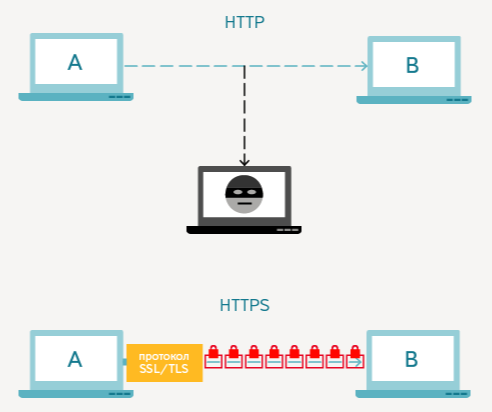

#### SSL/TLS (Transport Layer Security)

Протоколы защиты транспортного уровня

- Клиент подключается к серверу, поддерживающему TLS, и запрашивает защищённое соединение
- Клиент предоставляет список поддерживаемых алгоритмов шифрования и хеш-функций
- Сервер выбирает из списка, предоставленного клиентом, наиболее надёжные алгоритмы среди тех, которые поддерживаются сервером, и сообщает о своём выборе клиенту
- Сервер отправляет клиенту цифровой сертификат для собственной аутентификации. Обычно цифровой сертификат содержит имя сервера, имя удостоверяющего центра сертификации и открытый ключ сервера
- Клиент, до начала передачи данных, проверяет валидность (аутентичность) полученного серверного сертификата относительно имеющихся у клиента корневых сертификатов удостоверяющих центров (центров сертификации). Клиент также может проверить, не отозван ли серверный сертификат, связавшись с сервисом доверенного удостоверяющего центра
- Для шифрования сессии используется сеансовый ключ. Получение общего секретного сеансового ключа клиентом и сервером проводится по протоколу Диффи-Хеллмана. Существует исторический метод передачи сгенерированного клиентом секрета на сервер при помощи шифрования асимметричной криптосистемой RSA (используется ключ из сертификата сервера). Данный метод не рекомендован, но иногда продолжает встречаться на практике

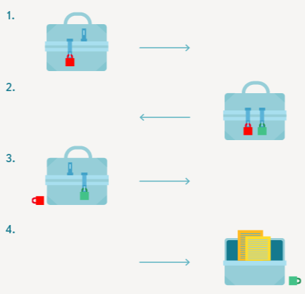

### REST (Representational state transfer)

Несколько принципов построения интерфейса обмена данных с сервером

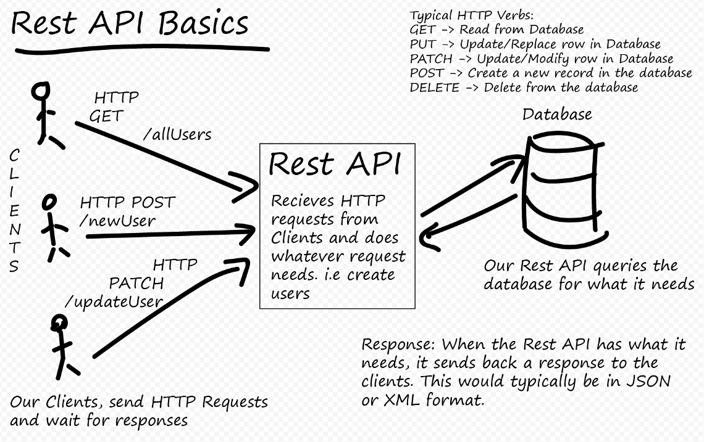

- Используем методы HTTP
- Добавляем данные методом POST
- Получаем методом GET
- Изменяем методом PATCH
- Удаляем методом DELETE
- Данные передаем и получаем через тело (body)
- Передаем аргументы через HTTP Query String

#### Query String

```
/api/search?user_id=3987
/api/search?start=50&limit=50
```

### Домашнее задание

Написать на Тарантуле прокси-сервер работающий по протоколу HTTP:
- Сервер должен открыть порт для подключения
- Полученный запрос передать на указанный хост
- Полученный ответ вернуть клиенту
- Настройки хранить в файле config.yml в формате YAML

Пример config.yml:

```yaml
---
proxy:
  port: 80
  bypass:
  	host: localhost
  	port: 8080
```
